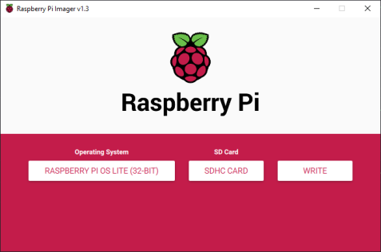
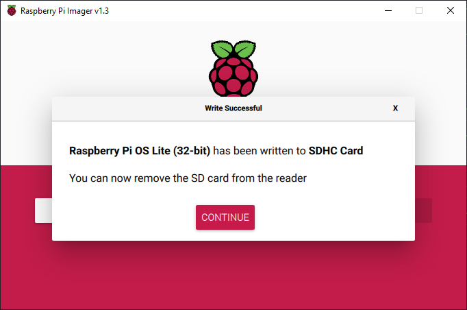
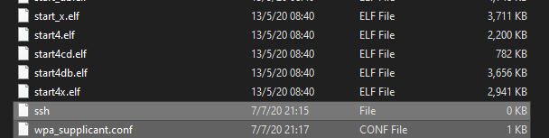
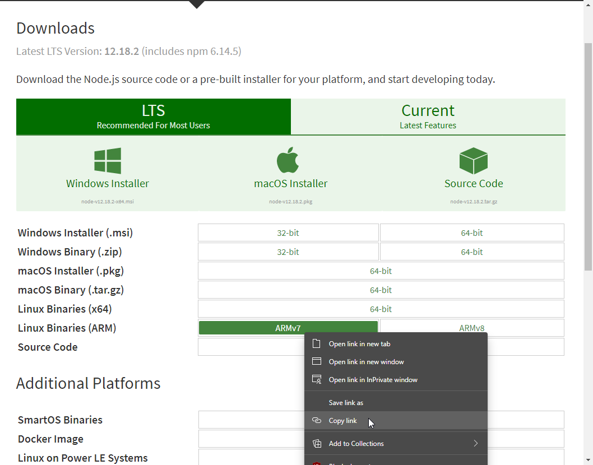

# EcoChain
Our project aims to support smart farming via the use of blockchains in agriculture.

By basing the project around blockchains and the use of a Raspberry Pi, it will serve to help to maintain the conditions of farmland using sensors and store said data in blockchains. 

Users will have an easier time to keep track of the state of their land and can also be easily notified when a certain aspect of the land needs to be taken care of.

Blockchain for Edge Devices Security Evaluation - Final Year Project in Singapore Polytechnic 

## Setting up on the Raspberry Pi
1. Download the Raspberry Pi Imager at [Raspberry Pi Foundation](https://www.raspberrypi.org/downloads/)

2. Run the Imager and choose the OS and SD card

Then click on write and wait till the image is validated


3. In order to enable SSH and WiFi connection on the Raspberry Pi without a monitor and keyboard, we need to create some files in the SD /boot partition called 'ssh' and 'wpa_supplicant.conf' respectively


4. In "wpa_supplicant.conf", we will configure the connection to a WiFi network.
```
ctrl_interface=DIR=/var/run/wpa_supplicant GROUP=netdev
update_config=1
country=SG

network={
 ssid="WiFi-Name"
 psk="WiFi-Password"
}
```

5. We then need to download and install [NodeJS](https://nodejs.org/en/download/) in order to compile our contract via [Truffle](https://www.trufflesuite.com/truffle)

```
wget [COPIED LINK HERE]
tar -xf node-vXX.XX.X-linux-armv7l.tar.xz   # unzip file
cd node-vXX.XX.X-linux-armv7
sudo cp -R * /usr/local                     # copy all files to PATH
node -v                                     # check node installation success
npm -v                                      # check npm installation success
```

## How to use
1. Clone repository
```
git clone https://github.com/EcoChain-SP-FYP/ecochain.git
```
2. Install Python dependencies
```
pip install -r requirements.txt
```
3. Run the program
```
python3 ./main.py {IP address}
```

### Setting up testing environment with Truffle and Ganache
1. Install [Truffle](https://www.trufflesuite.com/truffle)
```
npm install truffle -g
```
2. Install [Ganache](https://github.com/trufflesuite/ganache/releases)

3. Compile and deploy contracts
```
cd Truffle
truffle deploy
```